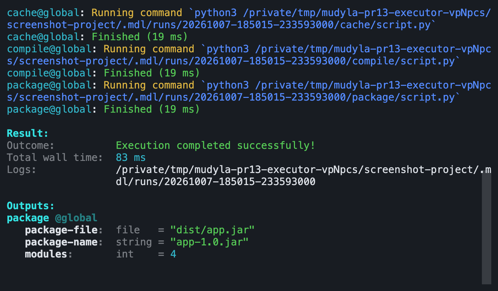
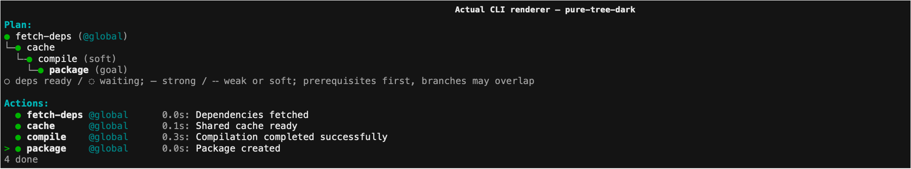
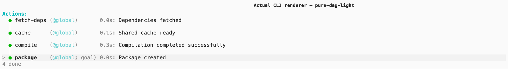
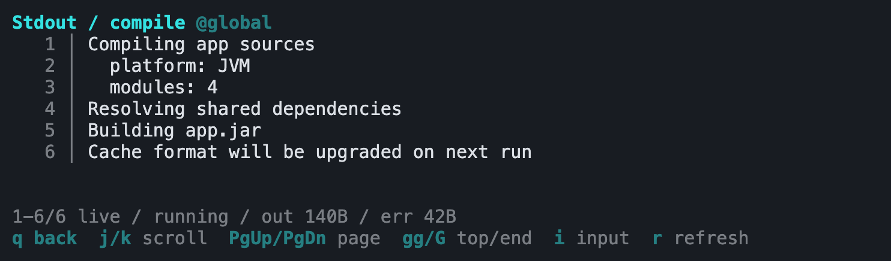
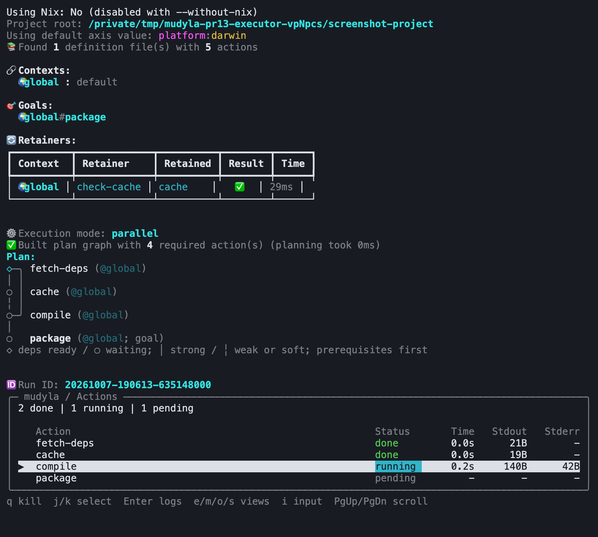
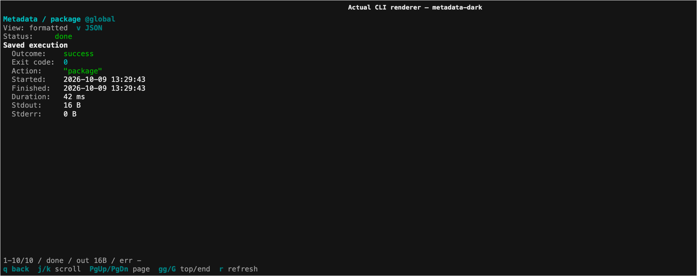
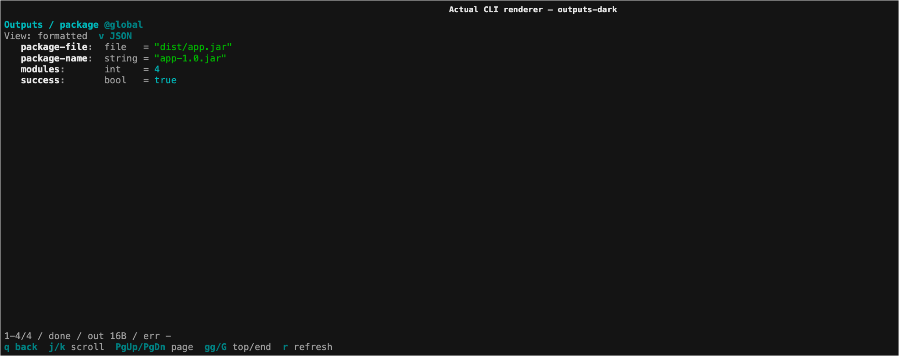
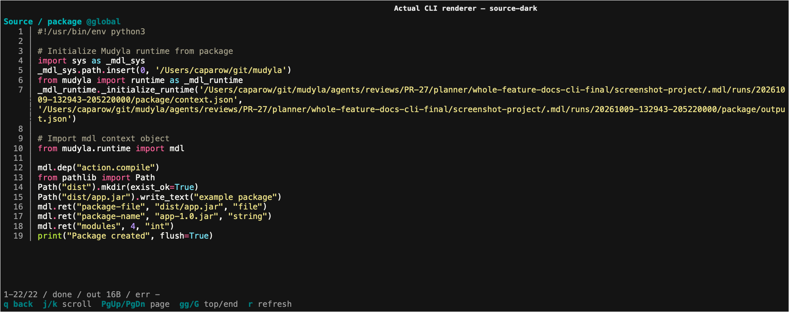

# CLI Reference

Usage: `mdl [OPTIONS] :goal1 :goal2 ...`

## Global Options

*   `--defs <pattern>`: Glob pattern for definition files (default: `.mdl/defs/**.md`).
*   `--out <file>`: Write output JSON to file.
*   `--dry-run`: Show execution plan without running.
*   `--seq`: Force sequential execution (disable parallel).
*   `--list-actions`: List all defined actions.
*   `--continue`: Resume from last run (skips successful actions).
*   `--verbose`: Alias for `--logger verbose`; stream commands and action output.
*   `--github-actions`: Alias for `--logger github`; stream output with GitHub Actions groups.
*   `--teamcity`: Alias for `--logger teamcity`; emit TeamCity service messages.
*   `--logger pure|table|simple|verbose|github|teamcity`: Select the logger (`pure` by default). `raw` remains an alias for `simple`.
*   `--plan tree|dag|table`: Select the plan presentation for every logger (default: `dag`).
*   `--plan-minimize true|false`: Omit redundant ordering connections in tree and DAG views (default: `true`). Table plans always retain all dependency information.
*   `--plan-dag-solver grid-auto|grid-low|grid-medium|grid-high|grid-opt|dagre|elk|sugiyama`: Select the DAG solver (default: `grid-auto`).
*   `--simple-log`: Alias for `--logger simple`.
*   `--force-interactive`: Force terminal rendering for pure/table (default `pure`). Append-only modes remain append-only.
*   `--no-color`: Remove colors. A nonempty `NO_COLOR` environment variable has the same effect; empty or unset values retain the default. `--force-interactive` respects this setting. Dim and bold text may remain, and raw mode preserves action-produced terminal sequences.
*   `--show-dirs`: Show action directories in the selected view.
*   `--without-nix`: Run without Nix isolation (default on Windows).
*   `--force-nix`: Force Nix integration even if it would normally be skipped (e.g., on Windows).
*   `--it`, `--interactive`: Show pure/table fullscreen and keep the view open after completion, when keyboard input is available.
*   `--fullscreen`: Show pure/table fullscreen during execution and exit automatically after completion.
*   `--timeout <ms>`: SIGKILL all running processes and their process trees when the specified number of milliseconds has elapsed.

## Arguments & Flags

*   `--<arg>=<value>`: Set a global argument.
*   `--<flag>`: Set a global flag.
*   `--axis <name>:<value>`: Set a global axis value (alias `-u`).

## Per-Action Options

Options can be scoped to specific goals by placing them *after* the goal.

```bash
mdl :build --arg=1 :test --arg=2
```

*   `:build` runs with `arg=1`.
*   `:test` runs with `arg=2`.

## Axis Wildcards

*   `-u name:*`: All values.
*   `-u name:val*`: Prefix match.

## Terminal Loggers

All six loggers use the same action definitions, arguments, compiler, scheduler,
and run artifacts. They change how execution appears:

| Logger | Behavior |
|--------|----------|
| `pure` (default) | Interactive Actions DAG with animated status, elapsed times, latest log lines and totals. Borderless detail views; optional separate Plan tree and checklist. |
| `table` | Content-sized live action columns, counts in the footer, and the same action controls and detail views. `--plan table` selects the full static plan table. |
| `simple` | Append-only command/start and completion markers, compact Plan and summaries. Captures successful output silently; shows the combined capture once on failure. |
| `verbose` | Simple's compact sections plus commands and immediate stdout/stderr, including partial prompts. Failure summaries identify the error and log files without replaying streamed output. |
| `github` | Shared compact sections with GitHub Actions groups, immediate unprefixed output and the established failure diagnostics. |
| `teamcity` | Shared compact sections through escaped TeamCity messages, action blocks and immediate child output. Parallel execution isolates native and ordinary messages by action flow. |

```bash
mdl :build :test
mdl --logger table :build :test
mdl --logger simple :build :test
mdl --logger verbose :build :test
mdl --logger github :build :test
mdl --logger teamcity :build :test
```

Simple and verbose use the shared terminal palette on a TTY and plain generated
text when redirected; GitHub uses the same sections with plain generated text.
They print one initial `Plan:` before execution, including
dry runs and continuation, followed by lifecycle events, `Result:` and typed
`Outputs:` when selected actions returned values. Empty action-output groups are
omitted; `--full-output` includes dependency outputs as well as goals. Saved JSON
keeps every selected action, including empty output maps. They never redraw the
terminal or take ownership of action stdin.
Their Actions markers use `action@context: Running command \`command\``, followed by
`Finished (duration)`, `Failed (duration)` or a distinct `Restored (duration)`.
Restored actions do not print a command-start marker. On colored terminals,
`Running command` is yellow, command text blue, completion green and failure red,
all at normal intensity without bold.
Markers retain one logical line; the terminal wraps long commands at its edge.
Sequential verbose and GitHub preserve unprefixed child text, ANSI and stdout/stderr
selection. Parallel verbose prefixes new records with `action@context: `, including
partial prompts, and separates interleaved fragments from different actions.
On capable terminals, prefixes reuse the identity foreground colors and restore
the child's foreground afterward. Other child attributes remain active. Prefixes
stay plain when color is disabled or terminal ownership cannot be established.
Prefixes wait for safe boundaries in split ANSI controls; CRLF stays intact.
A separator newline keeps a following logger record off a child's unfinished line.
An unfinished terminal control is cancelled at such a boundary on a usable TTY,
including after captured failure output; redirected output receives no cancellation
control. This is lexical boundary handling,
not isolation of arbitrary child terminal effects. Capture files retain original fragments.
`stdout.log` contains the existing combined stdout/stderr capture;
`stderr.log` contains stderr separately. Simple failures show the combined capture
once and give both paths. `--no-out-on-fail` suppresses that replay; verbose, GitHub and TeamCity continue streaming. GitHub completion markers appear inside their groups;
cancellation still closes every opened group. Failure replay remains outside them.
Verbose, GitHub and TeamCity default to sequential execution; `--par` overrides that choice.
Simple follows the project/default parallel policy.



### TeamCity transport

`--teamcity` and `--logger teamcity` select the same backend. Matching aliases are
accepted; conflicting logger flags fail before execution. `--logger raw --teamcity`
selects TeamCity. The older GitHub/verbose/simple precedence remains unchanged.
Both CI loggers already stream action output, so `--verbose` has no effect when
GitHub or TeamCity is selected, through either the alias or `--logger`.

For TeamCity jobs that build both older and newer revisions, use:

```bash
mdl --verbose --teamcity :build :test
```

Older revisions without the built-in TeamCity option select verbose logging and
parse `--teamcity` as a custom flag. Current revisions select TeamCity logging.
Append `--par` to use parallel execution in either revision. An explicit
`--logger verbose --teamcity` still conflicts; the compatibility applies to the
`--verbose` flag, not contradictory canonical logger selections.

TeamCity emits plain shared sections, one initial Plan and action blocks. It uses
UTF-8 for real standard output/error streams, including when `PYTHONIOENCODING`
originally selected ASCII or cp1252. Generated values use TeamCity escapes for
quotes, brackets, pipes, controls and Unicode, including surrogate pairs. Contexts,
outputs and diagnostics containing service-looking text remain literal messages.
`NO_COLOR` does not disable the protocol.

Sequential execution forwards child stdout/stderr immediately, without parsing
or rewriting native TeamCity records. `--par` incrementally routes ordinary
fragments as NORMAL messages and namespaces native `flowId`/`flowStarted parent`
values by the complete action context. Native test, progress, artifact and severity
attributes remain intact. Single-argument records retain their argument through
`tc:arg`. Ordinary stderr never implies an ERROR event. Capture files and `--out`
remain unchanged; failed child records are not replayed.

Only a partial service opener or an unfinished native record waits for more data.
An ordinary prompt therefore remains immediate; a prompt ending in a possible
opener such as `#` waits for disambiguation or action completion. Physical CR/LF
terminates a malformed candidate as literal text; escaped `|n`/`|r` remain values.
Candidates exceeding 1,048,576 decoded characters fail the action and terminate
its process tree. Incomplete final records become literal output.

Completion precedes block closure; cancellation closes remaining emitted blocks
without inventing completion or test results. Native enable/disable commands retain
their semantics. A child that leaves service-message processing disabled can make
TeamCity ignore later completion/closure records, even though mdl emits balanced
blocks; mdl does not synthesize an enable command. Protocol round trips were checked
with the official cached Java parser; no connected TeamCity server was exercised.

Pure combines the dependency graph and action list under one `Actions:` heading.
It aligns action names, contexts, durations and latest output, including
flushed prompts without a newline. Actions without a latest message show dim
`<empty>` after the duration. Its overview contains the same run information
printed before execution: Nix mode, project path, default axes, warnings, context
IDs mapped to compact values, goals, retainers, execution mode, dependency plan,
continuation source and current run ID. Every action/context appears as one selectable
node in component order, preserving execution order within each component. The `>` cursor occupies a separate left gutter; connector
and wrapped continuation rows do not become selectable actions. `--plan tree`
retains a separate updating `Plan:` tree above the flat `Actions:` list.
`--plan table` pairs a static `Plan:` table with the flat `Actions:` list.
Strong dependency edges use solid guides; weak and soft edges share dashed guides
(dotted guides in ASCII terminals). These patterns describe the declared dependency,
not whether a retainer executed.
Pure and the plan use `◌` for waiting and `○` for ready actions (`*` and `o` on ASCII terminals).
Pure animates a yellow half-filled circle (`◐◓◑◒`) while running, changing frames every 250 ms.
It uses a green `●` when done and a red `⊗` when failed.
Restored, skipped and cancelled actions use `◉`, `⊖` and `⊘`, respectively.
Completion and error marks use the same `●` and `⊗` symbols. Table status cells and
streamed lifecycle messages retain their text labels.
ASCII and limited encodings use the existing spinner, `+` for done/restored, `x` for
failed, `-` for skipped and `!` for cancelled.
Ready actions still follow the
selected sequential/parallel dispatch mode. Names come first, with context and
shared/goal/weak/soft annotations in dim parentheses. Page keys scroll this document;
selecting an action with the arrow keys reveals it. Pure and table render inline by
default, leaving the mouse wheel with terminal history. Opening a detail view temporarily
uses the alternate screen; `q` restores the inline overview and its selection.
Shrinking the terminal during inline updates can leave previous frame fragments in history.
`--fullscreen` keeps the live view in the alternate screen and exits after execution.
`--it` also keeps the completed view open. In fullscreen, the mouse wheel scrolls the view.
On exit both modes restore the preceding transcript. Pure prints its final Actions
graph once; `--plan tree` and `--plan table` print their respective plan and checklist.
Run facts appear together under `Run info:`; completion outcome, wall time and log
location appear under `Result:`. Action totals remain below the checklist.
Default-axis notices share one `Using default axes: axis:value, ...` field,
using the same axis-name and value colors as Contexts.
Run info and Result field labels are dim; their complete values keep normal intensity.
Context prefixes (`at`, `with`, `flags`) are dim, axis names blue, and argument/flag
names yellow. Axis and string values are green; counts and timings use cyan without bold.
Nested output keys and values keep normal intensity; type and index annotations remain dim.
These styles use the terminal's palette and default foreground. In pure and table modes,
the selected action rows get a subtle background tint when a truecolor or 256-color
terminal reports its background; all foreground colors and font weights remain unchanged. The tint spans the cursor,
connectors, wrapped label rows and right padding; standalone connector and prerequisite
reference rows remain unselected.
Unknown backgrounds, basic ANSI terminals and no-color output use the left cursor alone.
The same text remains available when colors or terminal styling are disabled.

Pure and table request the background once through OSC 11 after the initial frame, only when
both input and output are terminals. The existing input reader consumes the reply
without delaying startup. A short run may retain input ownership for the remaining
250 ms reply interval during shutdown; keys typed after quitting are not action input.
Replies arriving after the process exits cannot be consumed. The 256-color tint selects a fixed palette
color in the intended light/dark direction within 24 RGB channel values of the reported background.
An incomplete RGB reply remains recognizable while the viewer owns input; the first
character outside its grammar returns to normal keyboard handling. Hexadecimal keys
typed within such a partial reply cannot be distinguished from its remaining payload.
Use `--keep-run-dir`
to retain full stdout and stderr after success. Redirected output uses static action-labelled records
and streams complete output without animation. `--no-out-on-fail`
suppresses live action output as well as failure replay; action status and log
paths remain visible. `--verbose` and `--github-actions` retain their existing
streaming behavior.

`--it` / `--interactive` selects fullscreen inspection and keeps the selected view open;
it never changes the logger. `--force-interactive` bypasses terminal detection for
the selected logger, defaulting to pure. Legacy flags resolve with precedence
GitHub Actions, then verbose, then simple. `--logger raw --verbose` and
`--logger raw --github-actions` retain that behavior. A canonical explicit mode
accepts matching legacy flags and rejects a different resolved mode before actions
run. GitHub and TeamCity ignore the redundant `--verbose` flag.
Table requires terminal stdin/stdout and a usable `TERM` unless forced.
Pure normally uses static output for pipes and `TERM=dumb`/`unknown`.
Without terminal stdin, views cannot accept keys and do not stay open, even when
rendering is forced. Simple, verbose, GitHub and TeamCity ignore keep-open and force-rendering options.
`Ctrl+C` stops execution and returns exit status 130.

All Plan renderers follow the compiled execution graph. The DAG renders
each action/context once. The optional tree marks repeated dependencies as shared references; context identifiers distinguish separate action
invocations. Action listings and summaries use compact rows. Retainer presentation
uses compact rows in Pure and four columns in Table. Pure uses `@name` (or `@hash` with `--full-ctx-reprs`) consistently;
`@global` identifies the context with no overrides. Context rows align the identity,
`at axis:value, ...` and `with argument=value, ...` columns. Wrapped fields align
under the first axis or argument; flags remain explicit. Argument previews stop at
the first newline or 64 characters, appending `...` only when content was omitted.
Execution arguments and saved values stay unchanged.
With `--plan tree`, roots are actual prerequisite actions; their dependent actions branch below.
Only goal names are bold. The flat checklist follows the authoritative
dependency-first execution order without moving rows as statuses change.
In the optional tree, converging branches can refer to the same dependent.
A tree child inherits its parent's displayed context unless it changes;
shared references always include their context. The DAG labels every action/context once.

Run information includes the run ID allocated at startup and prints as it becomes available, followed by compiled contexts,
retainers when present, goals, the plan, actions and the result. During retainer
execution, Pure shows its running marker, elapsed time and latest stdout/stderr
message. Completed decisions show `retained` with a green marker or `ignored`
with an empty marker, followed by the action name and full context. Decision rows
have no duration or log fields. Table shows Retainer, Status, Elapsed and Result columns.
The dim planning summary shows compiler time and unique retained targets so far;
the action count appears after pruning. Compiler time excludes retainer execution
and dependency layout preparation.

Successful retainers stay compact. Failed retainers show their full captured stdout
and stderr beneath the summary, with indented `|` prefixes. Redirected and
append-only loggers print one Retainers heading and each completed block immediately
and once. Planning leaves stdin available to the retainer; keyboard, mouse and
background detection start only with the action logger. Live progress preserves
retention decisions, context identities and final output buffers. The existing
60-second timeout still reports empty stdout and `Timeout expired` on stderr.

Pure sections use the same heading style and order: heading, optional controls,
data, then a status/range summary, with one blank line between document sections.
Keyboard explanations stay in the bottom footer; metadata/output view selectors
sit below their heading. At five rows or fewer,
detail views omit this chrome to keep the full height available for content;
an active input editor still remains visible.

Pure result fields appear beneath their action and context as
`name: type = value`. Nested mappings and arrays keep their structure, and empty
values, false, zero and null remain explicit. Actions without output fields are
omitted from compact results; if none of the selected actions has output fields,
the `Outputs:` section is omitted. Table results and `--out` retain their existing
JSON data format, including empty action maps.

These renderer captures come from actual CLI sessions in a small example project.
The PNGs rasterize Rich SVG exports with CoreText/Menlo. The
[README](../../README.md#terminal-interfaces) uses the same images.



Plan uses a connected dependency graph by default with every logger.
Select a different presentation explicitly:

```bash
mdl :build :test
mdl --logger verbose --plan dag :build :test
mdl --plan tree :build :test
mdl --plan table :build :test
```

The explicit table Plan includes action numbers, contexts, goal markers, dependency
row references (`~` weak, `?` soft), and counts of sharing goal contexts. Action names
and context identifiers wrap in narrow terminals instead of losing their identity.
All loggers use the shared DAG layout by default. Executing pure attaches runtime
data and keyboard selection to this graph under `Actions:`; dry runs and other
loggers print a static `Plan:`. Explicit `--plan table`, `--plan tree`, and `--plan dag`
select the shared table, tree, or DAG, including with `--logger table`; the live action
table remains unchanged. These options do not change scheduling or pruning.

The DAG groups disconnected components with a blank line between them and places
each action/context once, preserving execution order within its component. Shared
prerequisites join at their dependent actions. Solid lanes mean strong
dependencies; dashed lanes mean weak or soft dependencies (`|` and `:` in ASCII).
By default, tree and DAG views show a minimized execution ordering: redundant endpoint pairs
are omitted when another displayed path preserves the same prerequisite ordering.
`--plan-minimize true` selects this default explicitly; `--plan-minimize false`
shows every retained dependency. The table presentation always shows full plan information. Scheduling, retention, metadata and
the prerequisites listed in narrow terminals retain every declared relationship.
This ordering view does not infer dependency strength from an alternate path.

Branches occupy distinct lanes. Each dependency keeps one vertical track, with
endpoint arms separated from action rows and neighboring turns. Crossings interrupt
the horizontal stroke while the vertical stroke continues (`-|-` in ASCII); they
never indicate a connection. Nonbranching paths share a stable palette slot. Fixed
light and dark palettes follow the existing terminal-background reply; an unknown
background uses ANSI colors. Colors depend on the displayed full action identities,
not status, resizing or solver choice. Changing between minimized and full views
can change the branch segments. Waiting connections are dim; ready and active
connections use normal intensity. Status glyphs keep their existing meanings and
styles. Pure uses the same DAG for its live and final Actions view.

When even single-column lanes cannot fit alongside labels, Plan explicitly lists
every action and its complete prerequisites instead. Widening the terminal
restores the connected layout. Text/log views and action navigation are unchanged.



[Dark theme screenshot](../ui/pure-dag-dark.png)

## Interactive Controls

Pure and table share the following controls while tasks run:

```bash
mdl --logger table :build :test
```

### Keep Running Mode

Use `--it` or `--interactive` to open the selected view fullscreen and keep it open after execution, allowing you to
review successful or failed action outputs and logs. Press `q` to close it. Without `--it`, the process
exits automatically after execution completes.
Use `--fullscreen` for fullscreen progress without waiting for `q`; combining both flags keeps the completed view open.

```bash
mdl --it :build :test
```

### Layout

Both views reveal the selected action when navigating with the arrow keys. Inline
overviews use only their populated rows within the current terminal height.
With `--fullscreen` or `--it`, scrolling up exposes the complete run information without changing
the selected action. `Home` reaches its beginning in either fullscreen view.
Closing a detail view
restores the overview's selection and scroll position. Header and
keyboard hints remain bounded by terminal dimensions. On narrow terminals,
secondary columns are omitted; output sizes remain available in detail views.
With `--show-dirs`, the selected action's directory moves above the list when a
directory column will not fit. Context identity respects `--full-ctx-reprs`.

Both views recompute layout after terminal width or height changes. Pure log and text
views fill the current terminal height. At five rows or fewer, optional headings and hints disappear
so content uses every row. An active input editor reserves its final row.
Press `q` to return to the compact checklist; detail text does not enter normal
terminal scrollback.



Table keeps aligned run information, contexts, retainers and its static plan in normal terminal history;
the same preparation remains reachable with `Home` during fullscreen inspection.
Its action table sizes columns to content, places counts below the rows, and uses the same
foreground-preserving selection tint as pure. The table and detail panels remain bounded by terminal height;
large action lists retain a keyboard-navigable window. The final table appears once.



### Keyboard Controls

**Action overview:**

| Key | Action |
|-----|--------|
| Arrows / `j` / `k` | Navigate between actions |
| Mouse wheel | Scroll terminal history inline; scroll the view fullscreen |
| `PgUp` / `PgDn` | Scroll the overview; move selection by pages in inline table |
| `Home` / `End` | First/last overview row; first/last action in inline table |
| `Enter` / `l` | View stdout logs |
| `e` | View stderr logs |
| `o` | View action outputs (`output.json`) |
| `m` | View action metadata (`meta.json`) |
| `s` | View Bash/Python source script |
| `i` | Enter input for the selected running action |
| `q` | Kill execution, or close the view after completion |

**Detail views:**

| Key | Action |
|-----|--------|
| Arrows / `j` / `k` | Scroll one line |
| Mouse wheel | Scroll three lines |
| `d` / `u` | Scroll half a page |
| `PgUp` / `PgDn` / `f` / `b` | Scroll a page |
| `gg` / `Home` | Jump to top |
| `G` / `End` | Jump to bottom |
| `r` | Refresh logs |
| `v` | Toggle formatted/original JSON in pure metadata and output views |
| `i` | Enter input for this running action in stdout only |
| `q` | Return to the action overview |

Both views capture the mouse wheel only while using the fullscreen display and restore
the terminal's previous mode when returning inline or exiting.
Pure keeps action positions stable while the list updates. Paused
log views preserve the same source line when resizing or receiving new output;
`G` resumes following the latest output.

### Action Input

In interactive pure and table, the viewer owns the keyboard. Select a running
action in the Actions list or stdout view and press `i` to send it input.
Other detail views and pending/finished actions do not offer input.
Type a line and press `Enter`; shortcuts
such as `q` are literal text while editing. Left/right and Backspace edit the
line; `Esc` returns to navigation without sending it. `Ctrl+D` closes that
action's stdin. `Ctrl+C` still cancels the entire run. Input stays bound to the
selected action, including its context, and navigation resumes when it finishes.
Completion and delivery feedback appears alongside the ordinary navigation controls. Lines are limited
to 4096 characters, with one pending write per action.

Raw and noninteractive execution retain inherited stdin, so normal piped input
continues to work. The editor sends lines to the action's pipe; it does not
provide a terminal emulator for nested interactive programs.

### Scrolling and Status

Logs follow new output while positioned at the end. Scrolling up pauses following;
returning to the bottom resumes it. Each action and detail view remembers its own
scroll position. The footer shows the visible line range and `live` when following
a log. Footer hints shorten with terminal width, keeping `q` visible; all shortcuts remain
available when a small terminal cannot display every hint.

Pure metadata starts with status, recorded outcome, exit code and any error, then
shows timing and output sizes in readable units. Restored actions distinguish their
current restored state from the original execution record. Unknown artifact fields
remain visible. Metadata and outputs open at the top; `v` reveals the original JSON
with exact numbers, timestamps and escapes. Each presentation remembers its own
position. Incomplete files show a read error while their available raw text remains
accessible; `r` refreshes after the action writes more data.







The Actions footers in pure and table report done, restored, running,
failed and pending action counts. Table also shows the visible action range for
large plans. Status remains explicit
text with or without color. Details preserve action-provided ANSI log styles,
while discarding terminal control commands. Raw JSON and source receive syntax
highlighting and line numbers; pure formatted fields use aligned labels, types and
values. Literal markup and terminal controls in JSON strings remain data; controls
appear as escaped text.

### Terminal Compatibility

Windows and non-UTF output encodings use ASCII borders and selection markers.
Display text that the output encoding cannot represent uses replacement
characters; action identities and execution arguments remain unchanged. Direct
Python execution on Windows uses Mudyla's interpreter; Nix commands retain their
selected runtime.

Tests cover logger selection, temporary real actions, success/failure, parallel
completion, suppression, partial prompts, cancellation, encoding fallback,
navigation, resize and terminal restoration. Native PTY checks ran on macOS.
The `Terminal interfaces` workflow configures Linux/macOS/Windows with Python
3.12, 3.13 and 3.14; its remote matrix has not been run as part of this change.

### Architecture

The CLI creates one concrete `TerminalLogger` mode before planning. The same
instance receives planner, retainer and action reports and owns the Console,
bound `SymbolsFormatter` and display session throughout the run. `report_plan`
prepares the authoritative pruned graph once; `start_actions` initializes real
action state and enables input. `finish_actions` restores the terminal before
outcome and output reports; `finish_run` provides idempotent cleanup on every path.
`SimpleTerminalLogger` prints lifecycle events; `VerboseTerminalLogger` adds immediate stream delivery;
`GitHubTerminalLogger` owns grouping and CI diagnostics; `TeamCityTerminalLogger` owns
TeamCity blocks, native-message routing and escaped presentation. The engine reports command,
output and completion events while retaining process, cancellation and artifact ownership.
The engine calls `end_action` after status notification and `finalize` after all
workers stop, so cancellation can close remaining records independently of transient `stop` calls.
Failure presentation receives the full `ActionKey` explicitly so context-specific diagnostics
use the correct flow. TeamCity shares the CLI formatter and its serialized writer with
the engine; its protocol adapter does not own processes or captured artifacts.
Pure inherits `TableTerminalLogger` and shares its task state, keyboard handling, artifact readers,
scrolling and lifecycle, while overriding its presentation. Both use Rich's alternate
screen for `--fullscreen`, `--it` sessions and temporary detail views, restoring inline progress on
return from a temporary detail view. Pure retains a
static streaming fallback. The engine sends bounded
output chunks through `write_output(action_key, text, stream)`; both viewers read
the existing artifact files for details. Interactive action stdin uses a pipe;
the viewer calls an engine callback with the complete `ActionKey` and a line
(or EOF). One bounded pending writer per action keeps navigation responsive.
For example, a Python action printing a flushed prompt reaches pure immediately,
while its `stdout.log` retains the original output decoded as UTF-8. No logger
creates a second execution pipeline or interprets action commands.

Context and artifact builders share the render-time wrapping in
`mudyla.logging.formatters.details`. Compact CLI preparation (pure/simple/verbose/GitHub/TeamCity) collects run fields and section
renderables, prints the completed collection before execution, and reuses those
same objects in pure's live overview. Early returns and preparation failures flush
the collected information exactly once. Declared output types are retained in `ActionResult`
when the existing artifact reader parses fresh or restored results; final pure
reporting therefore keeps types after ordinary run-directory cleanup. This internal
annotation does not change artifact schemas or the `--out` aggregate.
The live graph uses the selected ordering view of the final pruned graph and shared
task state. A frozen `DisplayEdges` retains the complete typed dependency tuple,
visible original indices and selected tuple. Default and native solvers consume
that selection before layout. A greedy top-down grid layout assigns compact node lanes.
A bounded interval allocator gives every complete dependency
one distinct vertical track while its interval overlaps another edge. Routes have
at most four endpoint bends; this heuristic does not claim optimal crossings or width.
Connector rows adapt to the actual routes: straight continuations may use the next
action row, while turns receive one to three rows as needed for crossing clearance
and visible dependency strength. Adjacent endpoints retain a visible branch segment.
Independent tracks have a blank column between them; disconnected
components receive one blank separator. Keyboard navigation follows this component-grouped presentation;
the scheduler retains its original execution order.
The CLI solves this geometry and its routing tracks once after pruning. Preparation,
live views and the final graph share the immutable solution; resizing wraps labels and
maps cached connector rows without solving again. Narrow terminals list prerequisites
with their declared strength and retainer instead of drawing overlapping lanes.
Pure DAG mode renders it once under Actions, retaining the recorded run information
in its original order. The optional tree remains a separate live Plan. The shared tree formatter wraps deep
branches when their guides would otherwise exhaust the terminal width.
`mudyla.logging.formatters.dag` derives its lane layout from retained dependency
records and the supplied execution order. The immutable `DagLayout.execution_order`
retains that original order, while `DagLayout.keys` groups connected components.
Status callbacks supply intensity and a required theme provider supplies the branch
palette without changing node positions or importing interactive logger state.
Readiness uses the complete execution graph even when the display omits shortcuts. Its
shared `visual_lines` renderer accepts node labels and returns full-ActionKey row
anchors. Pure uses those anchors for keyboard selection and resize visibility;
connector rows remain ordinary scrollable document lines.
Pure executions omit the initial Plan from the transcript and print the final
Actions graph once after execution; dry runs print one initial Plan.
Simple, verbose, GitHub and TeamCity retain the initial plan and do not replay it at completion.

### Experimental native DAG layouts

DAG plans use the native Python Grid-auto solver by default. Select another solver to compare the supported algorithms:

```bash
mdl --without-nix --plan-dag-solver grid-low --dry-run :demo-interactive
mdl --without-nix --plan-dag-solver grid-auto --fullscreen :demo-interactive
```

| Solver | Placement and selection |
| --- | --- |
| `grid-low` | The fully evaluated greedy seed. |
| `grid-medium` | The same Grid search, up to 20 complete layout evaluations. |
| `grid-high` | The same Grid search, up to 100 complete layout evaluations. |
| `grid-opt` | The same finite Grid search without an effort cap, within the shared time limit. |
| `dagre` | Longest-path ranks, weighted median ordering, transpose passes and corrected Brandes–Köpf coordinates. |
| `sugiyama` | Dependency-depth ranks, barycenter ordering and bounded quadratic coordinate relaxation. |
| `elk` | Linear-segment placement, pendulum passes and orthogonal north/south port channels with common-target trunks. |
| `grid-auto` | Continue one Grid search through the effort checkpoints until exhaustion or the time limit. |

These selectors use Python implementations of the stated algorithm phases;
they do not reproduce complete upstream engines or require an external runtime.
An explicit `--plan-dag-solver` requires `--plan dag`. Tree and table presentations
bypass DAG solving when the solver option is omitted. The DAG works with inline
progress, `--fullscreen` and `--it`.

Native candidates retain their unrelated-overlap, crossing and normalized-area
scores. Grid and Auto evaluate their displayed action-row gutter separately: overlaps,
then crossing cells, then gutter area per action. Equal scores retain the earlier
incumbent. Distinct
tracks and separated endpoint arms exclude unrelated overlaps in this projection.
One try includes a feasible whole-graph lane assignment, native scoring and its
complete cached projection. The greedy seed counts as try 1 and remains selected
until a completed try improves the displayed score. Auto continues one owned
search without reseeding, retaining reached checkpoints and the final incumbent.
The finite domain includes every feasible dense lane ordering for the fixed action
order; exhaustion proves its optimum for the supplied objective. An effort or
time limit provides no proof. This does not claim an optimum across other layout
algorithms. Dagre, ELK and Sugiyama remain manual selectors.

One shared 200 ms deadline bounds the complete layout operation, including
search expansion, native scoring and displayed projection. A deadline returns the
best complete cached Grid incumbent; if even the seed cannot finish, the CLI
reports the unfinished phase explicitly. Partial evaluations never replace an
incumbent or count as tries. Other failures propagate with attempt history.
These effort limits tune work rather than guaranteeing a fixed improvement.
Deadline checks run cooperatively between finite operations; scheduling and
checkpoint overhead can slightly exceed the nominal time limit.

Terminal presentation keeps the existing action rows, including names, contexts,
durations, latest output, selection and details. The selected layout supplies
node-column preferences to an orthogonal dependency gutter. Unrelated crossings
receive cuts in the horizontal stroke; the vertical stroke continues. Narrow
views list prerequisite identities, including dependency strengths and retainers.
Each connected component receives a separate block. Native scores and displayed
selection scores describe different geometries and remain separately inspectable.

Internally, `build_dag_layout` prepares the chosen ordering view, solver input and
complete terminal projection under one shared budget. The terminal uses one-cell
graph markers and renders labels beside the gutter:

```python
layout = build_dag_layout(graph, execution_order, mode="auto", minimize=True)
```

`layout.preparation_ms` measures the complete preparation interval, including
dependency reduction, input construction, native solving and terminal projection.
CLI, Engine and Pure reuse this same builder and immutable layout. For lower-level
mathematical callers, `build_solver_input(graph, execution_order, node_sizes,
display=display, budget=budget)` preserves the schedule, component presentation
order and full-key typed edges. `create_solver(mode, input, objective=objective,
budget=budget)` receives the caller-owned budget explicitly.

`CandidateObjective.score(candidate, budget)` provides the required solver objective;
`NativeObjective()` retains raw-geometry selection for mathematical/reference callers.
`RowProjectionObjective` caches complete projections by their integer action columns.
Each distinct column arrangement is routed and rasterized at most once, before its
selection score becomes eligible. The chosen layout retrieves that cached raster,
including when later candidate work exhausts the shared budget. Preparation, execution and the final view
share that immutable row layout. Each solver owns its cached result; Auto owns one
continuing `GridSearch`. Its `advance(effort_limit)` returns an immutable candidate
with evaluated-layout count, best try, cap, exhaustion and stop reason. Resizing, status updates and selection reuse
that layout without repeating placement, routing or optimization.
