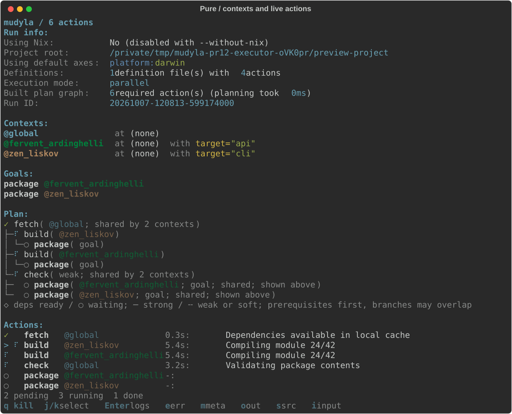
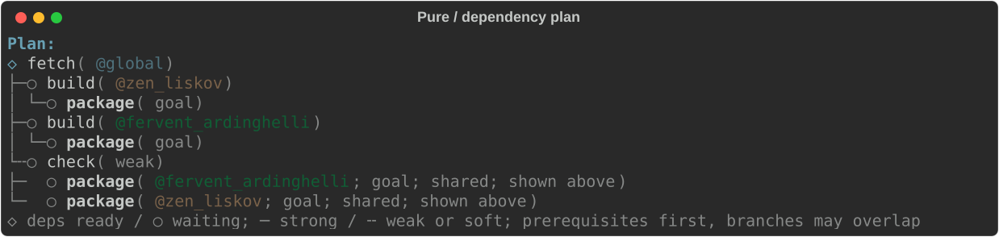
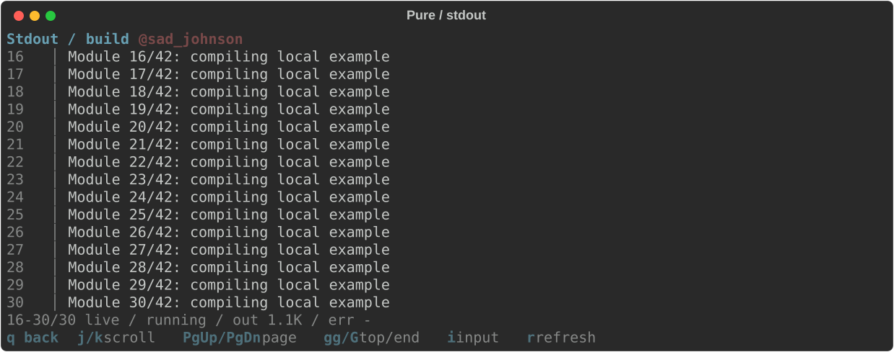
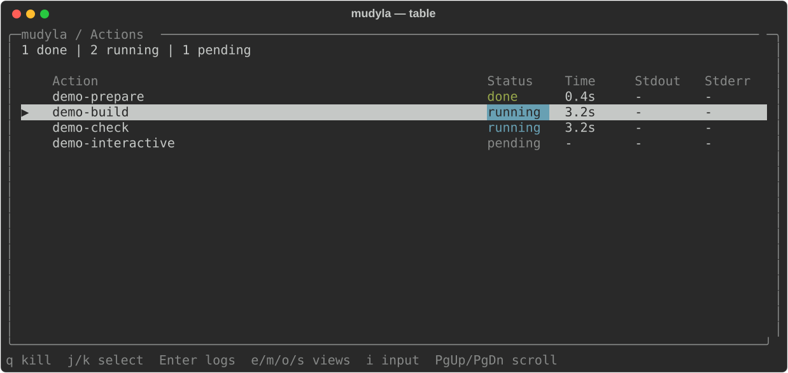
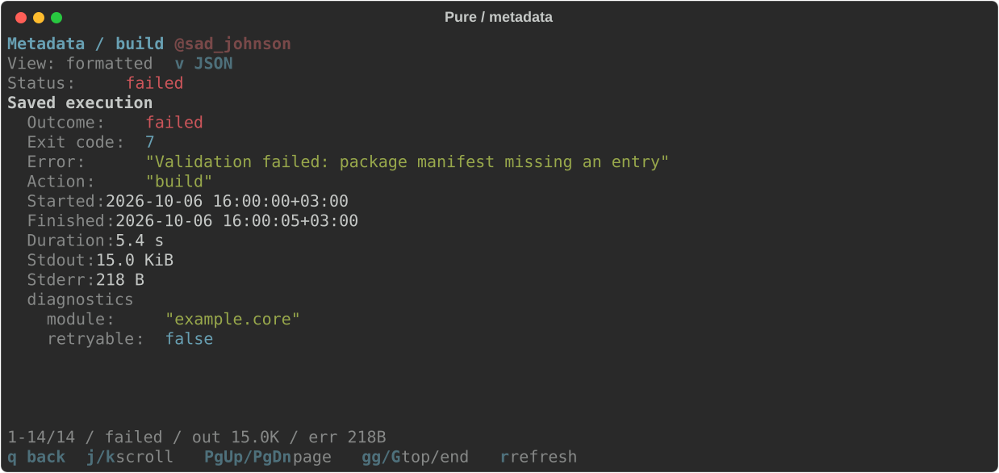
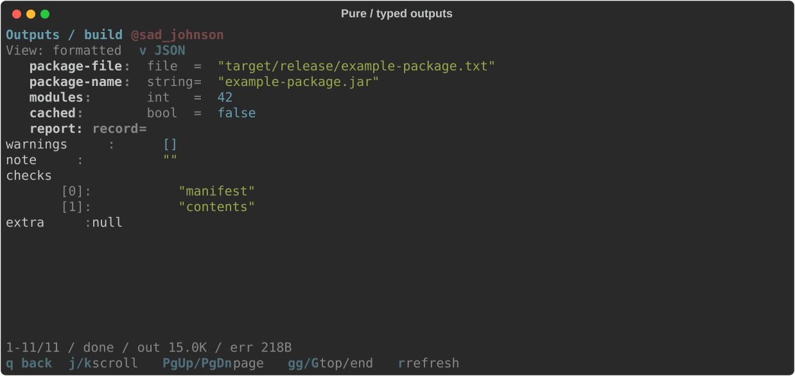

# CLI Reference

Usage: `mdl [OPTIONS] :goal1 :goal2 ...`

## Global Options

*   `--defs <pattern>`: Glob pattern for definition files (default: `.mdl/defs/**.md`).
*   `--out <file>`: Write output JSON to file.
*   `--dry-run`: Show execution plan without running.
*   `--seq`: Force sequential execution (disable parallel).
*   `--list-actions`: List all defined actions.
*   `--continue`: Resume from last run (skips successful actions).
*   `--verbose`: Alias for `--logger verbose`; stream commands and action output.
*   `--github-actions`: Alias for `--logger github`; stream output with GitHub Actions groups.
*   `--teamcity`: Alias for `--logger teamcity`; emit TeamCity service messages.
*   `--logger pure|table|simple|verbose|github|teamcity`: Select the logger (`pure` by default). `raw` remains an alias for `simple`.
*   `--simple-log`: Alias for `--logger simple`.
*   `--force-interactive`: Force terminal rendering for pure/table (default `pure`). Append-only modes remain append-only.
*   `--no-color`: Remove colors. A nonempty `NO_COLOR` environment variable has the same effect; empty or unset values retain the default. `--force-interactive` respects this setting. Dim and bold text may remain, and raw mode preserves action-produced terminal sequences.
*   `--show-dirs`: Show action directories in the selected view.
*   `--without-nix`: Run without Nix isolation (default on Windows).
*   `--force-nix`: Force Nix integration even if it would normally be skipped (e.g., on Windows).
*   `--it`, `--interactive`: Keep a supported logger open after completion, when keyboard input is available.
*   `--timeout <ms>`: SIGKILL all running processes and their process trees when the specified number of milliseconds has elapsed.

## Arguments & Flags

*   `--<arg>=<value>`: Set a global argument.
*   `--<flag>`: Set a global flag.
*   `--axis <name>:<value>`: Set a global axis value (alias `-u`).

## Per-Action Options

Options can be scoped to specific goals by placing them *after* the goal.

```bash
mdl :build --arg=1 :test --arg=2
```

*   `:build` runs with `arg=1`.
*   `:test` runs with `arg=2`.

## Axis Wildcards

*   `-u name:*`: All values.
*   `-u name:val*`: Prefix match.

## Terminal Loggers

All six loggers use the same action definitions, arguments, compiler, scheduler,
and run artifacts. They change how execution appears:

| Logger | Behavior |
|--------|----------|
| `pure` (default) | Interactive compact checklist with animated running tasks, elapsed times, latest log lines and totals. Borderless detail views; dependency-tree plans. |
| `table` | The same action controls and detail views, presented in a bordered table. |
| `simple` | Append-only command/start and completion markers, compact Plan and summaries. Captures successful output silently; shows the combined capture once on failure. |
| `verbose` | Simple's compact sections plus commands and immediate stdout/stderr, including partial prompts. Failure summaries identify the error and log files without replaying streamed output. |
| `github` | Shared compact sections with GitHub Actions groups, immediate unprefixed output and the established failure diagnostics. |
| `teamcity` | Shared compact sections through escaped TeamCity messages, action blocks and immediate child output. Parallel execution isolates native and ordinary messages by action flow. |

```bash
mdl :build :test
mdl --logger table :build :test
mdl --logger simple :build :test
mdl --logger verbose :build :test
mdl --logger github :build :test
mdl --logger teamcity :build :test
```

Simple and verbose use the shared terminal palette on a TTY and plain generated
text when redirected; GitHub uses the same sections with plain generated text.
They print one initial `Plan:` before execution, including
dry runs and continuation, followed by lifecycle events, `Result:` and typed
`Outputs:`. They never redraw the terminal or take ownership of action stdin.
Their Actions markers use `action@context: Running command \`command\``, followed by
`Finished (duration)`, `Failed (duration)` or a distinct `Restored (duration)`.
Restored actions do not print a command-start marker. On colored terminals,
`Running command` is yellow, command text blue, completion green and failure red,
all at normal intensity without bold.
Markers retain one logical line; the terminal wraps long commands at its edge.
Sequential verbose and GitHub preserve unprefixed child text, ANSI and stdout/stderr
selection. Parallel verbose prefixes new records with `action@context: `, including
partial prompts, and separates interleaved fragments from different actions.
On capable terminals, prefixes reuse the identity foreground colors and restore
the child's foreground afterward. Other child attributes remain active. Prefixes
stay plain when color is disabled or terminal ownership cannot be established.
Prefixes wait for safe boundaries in split ANSI controls; CRLF stays intact.
A separator newline keeps a following logger record off a child's unfinished line.
An unfinished terminal control is cancelled at such a boundary on a usable TTY,
including after captured failure output; redirected output receives no cancellation
control. This is lexical boundary handling,
not isolation of arbitrary child terminal effects. Capture files retain original fragments.
`stdout.log` contains the existing combined stdout/stderr capture;
`stderr.log` contains stderr separately. Simple failures show the combined capture
once and give both paths. `--no-out-on-fail` suppresses that replay; verbose, GitHub and TeamCity continue streaming. GitHub completion markers appear inside their groups;
cancellation still closes every opened group. Failure replay remains outside them.
Verbose, GitHub and TeamCity default to sequential execution; `--par` overrides that choice.
Simple follows the project/default parallel policy.

### TeamCity transport

`--teamcity` and `--logger teamcity` select the same backend. Matching aliases are
accepted; conflicting logger flags fail before execution. `--logger raw --teamcity`
selects TeamCity. The older GitHub/verbose/simple precedence remains unchanged.

TeamCity emits plain shared sections, one initial Plan and action blocks. It uses
UTF-8 for real standard output/error streams, including when `PYTHONIOENCODING`
originally selected ASCII or cp1252. Generated values use TeamCity escapes for
quotes, brackets, pipes, controls and Unicode, including surrogate pairs. Contexts,
outputs and diagnostics containing service-looking text remain literal messages.
`NO_COLOR` does not disable the protocol.

Sequential execution forwards child stdout/stderr immediately, without parsing
or rewriting native TeamCity records. `--par` incrementally routes ordinary
fragments as NORMAL messages and namespaces native `flowId`/`flowStarted parent`
values by the complete action context. Native test, progress, artifact and severity
attributes remain intact. Single-argument records retain their argument through
`tc:arg`. Ordinary stderr never implies an ERROR event. Capture files and `--out`
remain unchanged; failed child records are not replayed.

Only a partial service opener or an unfinished native record waits for more data.
An ordinary prompt therefore remains immediate; a prompt ending in a possible
opener such as `#` waits for disambiguation or action completion. Physical CR/LF
terminates a malformed candidate as literal text; escaped `|n`/`|r` remain values.
Candidates exceeding 1,048,576 decoded characters fail the action and terminate
its process tree. Incomplete final records become literal output.

Completion precedes block closure; cancellation closes remaining emitted blocks
without inventing completion or test results. Native enable/disable commands retain
their semantics. A child that leaves service-message processing disabled can make
TeamCity ignore later completion/closure records, even though mdl emits balanced
blocks; mdl does not synthesize an enable command. Protocol round trips were checked
with the official cached Java parser; no connected TeamCity server was exercised.

Pure aligns action names, contexts, durations and latest output in compact columns, including
flushed prompts without a newline. Its overview contains the same run information
printed before execution: Nix mode, project path, default axes, warnings, context
IDs mapped to compact values, goals, retainers, execution mode, dependency tree,
continuation source and current run ID. These are followed by one list of every
action in execution order, with an updating `Plan:` above `Actions:`.
Strong dependency edges use solid guides; weak and soft edges share dashed guides
(dotted guides in ASCII terminals). These patterns describe the declared dependency,
not whether a retainer executed.
The tree uses the checklist's status glyphs; `◇` means prerequisites completed and
`○` means waiting (`>` and `o` on ASCII terminals). Ready actions still follow the
selected sequential/parallel dispatch mode. Names come first, with context and
shared/goal/weak/soft annotations in dim parentheses. Mouse wheel and
page keys scroll this document; selecting an action with the arrow keys reveals it.
Both interactive views temporarily own the alternate terminal
screen; on exit they restore the preceding transcript. Pure prints the final tree and checklist once.
Run facts appear together under `Run info:`; completion outcome, wall time and log
location appear under `Result:`. Action totals remain below the checklist.
Default-axis notices share one `Using default axes: axis:value, ...` field,
using the same axis-name and value colors as Contexts.
Run info and Result field labels are dim; their complete values keep normal intensity.
Context prefixes (`at`, `with`, `flags`) are dim, axis names blue, and argument/flag
names yellow. Axis and string values are green; counts and timings use cyan without bold.
Nested output keys and values keep normal intensity; type and index annotations remain dim.
These styles use the terminal's palette and default foreground, with no fixed background;
the same text remains available when colors or terminal styling are disabled.
Use `--keep-run-dir`
to retain full stdout and stderr after success. Redirected output uses static action-labelled records
and streams complete output without animation. `--no-out-on-fail`
suppresses live action output as well as failure replay; action status and log
paths remain visible. `--verbose` and `--github-actions` retain their existing
streaming behavior.

`--it` / `--interactive` only controls whether the selected view stays open;
it never changes the logger. `--force-interactive` bypasses terminal detection for
the selected logger, defaulting to pure. Legacy flags resolve with precedence
GitHub Actions, then verbose, then simple. `--logger raw --verbose` and
`--logger raw --github-actions` retain that behavior. A canonical explicit mode
accepts matching legacy flags and rejects a different resolved mode before actions
run. GitHub combined with `--verbose` also retains verbose retainer diagnostics.
Table requires terminal stdin/stdout and a usable `TERM` unless forced.
Pure normally uses static output for pipes and `TERM=dumb`/`unknown`.
Without terminal stdin, views cannot accept keys and do not stay open, even when
rendering is forced. Simple, verbose, GitHub and TeamCity ignore keep-open and force-rendering options.
`Ctrl+C` stops execution and returns exit status 130.

The dependency tree follows the compiled execution graph. Repeated dependencies
are marked as shared references; context identifiers distinguish separate action
invocations. Retainers, action listings and summaries use compact rows rather than
bordered tables. Pure uses `@name` (or `@hash` with `--full-ctx-reprs`) consistently;
`@global` identifies the context with no overrides. Context rows align the identity,
`at axis:value, ...` and `with argument=value, ...` columns. Wrapped fields align
under the first axis or argument; flags remain explicit. Argument previews stop at
the first newline or 64 characters, appending `...` only when content was omitted.
Execution arguments and saved values stay unchanged.
Tree roots are actual prerequisite actions; their dependent actions branch below.
Only goal names are bold. Parallel branches may overlap, and converging branches
can refer to the same dependent; the flat checklist follows the authoritative
dependency-first execution order without moving rows as statuses change.
A child inherits its parent's displayed context unless it changes;
shared references always include their context.
Pure sections use the same heading style and order: heading, optional controls,
data, then a status/range summary, with one blank line between document sections.
Keyboard explanations stay in the bottom footer; metadata/output view selectors
sit below their heading. At five rows or fewer,
detail views omit this chrome to keep the full height available for content;
an active input editor still remains visible.

Pure result fields appear beneath their action and context as
`name: type = value`. Nested mappings and arrays keep their structure, and empty
values, false, zero and null remain explicit. Raw/table results and `--out` retain
their existing JSON data format.





## Interactive Controls

Pure and table share the following controls while tasks run:

```bash
mdl --logger table :build :test
```

### Keep Running Mode

Use `--it` or `--interactive` to keep the selected view open after execution, allowing you to
review successful or failed action outputs and logs. Press `q` to close it. Without `--it`, the process
exits automatically after execution completes.

```bash
mdl --it :build :test
```

### Layout

Both views reveal the selected action when navigating with the arrow keys. Pure's
overview uses all available terminal rows, and scrolling up exposes the complete
run information without changing the selected action. `Home` reaches its beginning.
Closing a detail view
restores the overview's selection and scroll position. Header and
keyboard hints remain bounded by terminal dimensions. On narrow terminals,
secondary columns are omitted; output sizes remain available in detail views.
With `--show-dirs`, the selected action's directory moves above the list when a
directory column will not fit. Context identity respects `--full-ctx-reprs`.

Pure log and text views fill the current terminal height and recompute scrolling
after every resize. At five rows or fewer, optional headings and hints disappear
so content uses every row. An active input editor reserves its final row.
Press `q` to return to the compact checklist; detail text does not enter normal
terminal scrollback.





### Keyboard Controls

**Action overview:**

| Key | Action |
|-----|--------|
| Arrows / `j` / `k` | Navigate between actions |
| Mouse wheel / `PgUp` / `PgDn` | Scroll the pure overview; move selection by rows/pages in table |
| `Home` / `End` | First/last overview row in pure; first/last action in table |
| `Enter` / `l` | View stdout logs |
| `e` | View stderr logs |
| `o` | View action outputs (`output.json`) |
| `m` | View action metadata (`meta.json`) |
| `s` | View Bash/Python source script |
| `i` | Enter input for the selected running action |
| `q` | Kill execution, or close the view after completion |

**Detail views:**

| Key | Action |
|-----|--------|
| Arrows / `j` / `k` | Scroll one line |
| Mouse wheel | Scroll three lines |
| `d` / `u` | Scroll half a page |
| `PgUp` / `PgDn` / `f` / `b` | Scroll a page |
| `gg` / `Home` | Jump to top |
| `G` / `End` | Jump to bottom |
| `r` | Refresh logs |
| `v` | Toggle formatted/original JSON in pure metadata and output views |
| `i` | Enter input for this running action in stdout only |
| `q` | Return to the action overview |

Interactive sessions capture the mouse wheel and restore the terminal's previous
mode on exit. Pure keeps action positions stable while the list updates. Paused
log views preserve the same source line when resizing or receiving new output;
`G` resumes following the latest output.

### Action Input

In interactive pure and table, the viewer owns the keyboard. Select a running
action in the Actions list or stdout view and press `i` to send it input.
Other detail views and pending/finished actions do not offer input.
Type a line and press `Enter`; shortcuts
such as `q` are literal text while editing. Left/right and Backspace edit the
line; `Esc` returns to navigation without sending it. `Ctrl+D` closes that
action's stdin. `Ctrl+C` still cancels the entire run. Input stays bound to the
selected action, including its context, and navigation resumes when it finishes.
Completion and delivery feedback appears alongside the ordinary navigation controls. Lines are limited
to 4096 characters, with one pending write per action.

Raw and noninteractive execution retain inherited stdin, so normal piped input
continues to work. The editor sends lines to the action's pipe; it does not
provide a terminal emulator for nested interactive programs.

### Scrolling and Status

Logs follow new output while positioned at the end. Scrolling up pauses following;
returning to the bottom resumes it. Each action and detail view remembers its own
scroll position. The footer shows the visible line range and `live` when following
a log. Footer hints shorten with terminal width, keeping `q` visible; all shortcuts remain
available when a small terminal cannot display every hint.

Pure metadata starts with status, recorded outcome, exit code and any error, then
shows timing and output sizes in readable units. Restored actions distinguish their
current restored state from the original execution record. Unknown artifact fields
remain visible. Metadata and outputs open at the top; `v` reveals the original JSON
with exact numbers, timestamps and escapes. Each presentation remembers its own
position. Incomplete files show a read error while their available raw text remains
accessible; `r` refreshes after the action writes more data.





The Actions footer in pure and the header in table report done, restored, running,
failed and pending action counts. Table also shows the visible action range for
large plans. Status remains explicit
text with or without color. Details preserve action-provided ANSI log styles,
while discarding terminal control commands. Raw JSON and source receive syntax
highlighting and line numbers; pure formatted fields use aligned labels, types and
values. Literal markup and terminal controls in JSON strings remain data; controls
appear as escaped text.

### Terminal Compatibility

Windows and non-UTF output encodings use ASCII borders and selection markers.
Display text that the output encoding cannot represent uses replacement
characters; action identities and execution arguments remain unchanged. Direct
Python execution on Windows uses Mudyla's interpreter; Nix commands retain their
selected runtime.

Tests cover logger selection, temporary real actions, success/failure, parallel
completion, suppression, partial prompts, cancellation, encoding fallback,
navigation, resize and terminal restoration. Native PTY checks ran on macOS.
The `Terminal interfaces` workflow configures Linux/macOS/Windows with Python
3.12, 3.13 and 3.14; its remote matrix has not been run as part of this change.

### Architecture

`ExecutionEngine` selects one of the six `ActionLogger` implementations in
`mudyla.logging`. The CLI resolves aliases once. `ActionLoggerSimple` prints
lifecycle events; `ActionLoggerVerbose` adds immediate stream delivery;
`ActionLoggerGitHub` owns grouping and CI diagnostics; `ActionLoggerTeamCity` owns
TeamCity blocks, native-message routing and escaped presentation. The engine reports command,
output and completion events while retaining process, cancellation and artifact ownership.
The engine calls `end_action` after status notification and `finalize` after all
workers stop, so cancellation can close remaining records independently of transient `stop` calls.
Failure presentation receives the full `ActionKey` explicitly so context-specific diagnostics
use the correct flow. TeamCity shares the CLI formatter and its serialized writer with
the engine; its protocol adapter does not own processes or captured artifacts.
Pure inherits `ActionLoggerTable` and shares its task state, keyboard handling, artifact readers,
scrolling and lifecycle, while overriding its presentation. Both use Rich's
alternate screen. Pure retains a static streaming fallback. The engine sends bounded
output chunks through `write_output(action_key, text, stream)`; both viewers read
the existing artifact files for details. Interactive action stdin uses a pipe;
the viewer calls an engine callback with the complete `ActionKey` and a line
(or EOF). One bounded pending writer per action keeps navigation responsive.
For example, a Python action printing a flushed prompt reaches pure immediately,
while its `stdout.log` retains the original output decoded as UTF-8. No logger
creates a second execution pipeline or interprets action commands.

Context and artifact builders share the render-time wrapping in
`mudyla.logging.formatters.details`. Compact CLI preparation (pure/simple/verbose/GitHub/TeamCity) collects run fields and section
renderables, prints the completed collection before execution, and reuses those
same objects in pure's live overview. Early returns and preparation failures flush
the collected information exactly once. Declared output types are retained in `ActionResult`
when the existing artifact reader parses fresh or restored results; final pure
reporting therefore keeps types after ordinary run-directory cleanup. This internal
annotation does not change artifact schemas or the `--out` aggregate.
The live tree uses the exact pruned execution graph and the checklist's task state.
Only the static preparation tree is replaced in the live overview; other recorded
run information keeps its original order. The shared tree formatter wraps deep
branches when their guides would otherwise exhaust the terminal width.
Pure executions omit the initial tree from the transcript and print its final
states once after execution; dry runs print one initial plan.
Simple, verbose, GitHub and TeamCity retain the initial plan and do not replay it at completion.
